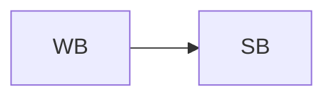

# Práctica 4. Gerard Cots y Joel J. Morera

## Generación de una página web

### Parte 1 : Ejemplo de prueba

###### **Funcionamiento**

El programa en cuestión consiste en utilizar el ESP32 como servidor para generar una página web a la qual podemos acceder mediante la IP del procesador.

Para ello, en primer lugar, nos conectamos a una red Wi-Fi, especificando su SSID y contrseña. Una vez establecida la conexión, iniciamos el servidor cuyo código HTML viene definido dentro del programa.

Respecto al servidor, cabe destacar que utilizamos el puerto 80, que esta asociado al protocolo de internet HTTP.

###### **Código del programa**

```cpp
#include <WiFi.h>
#include <WebServer.h>

// SSID & Password
const char* ssid = "*****"; // Enter your SSID here
const char* password = "*****"; //Enter your Password here

WebServer server(80);// Object of WebServer(HTTP port, 80 is default)

void handle_root();//Function definition

void setup() 
{
    Serial.begin(115200);
    Serial.print("Try Connecting to ");
    Serial.println(ssid);
    // Connect to your wi-fi modem
    WiFi.begin(ssid, password);
    // Check wi-fi is connected to wi-fi network
    while (WiFi.status() != WL_CONNECTED) 
    {
        delay(1000);
        Serial.print(".");
    }
    Serial.println("");
    Serial.println("WiFi connected successfully");
    Serial.print("Got IP: ");
    Serial.println(WiFi.localIP()); //Show ESP32 IP on serial
    server.on("/", handle_root);
    server.begin();
    Serial.println("HTTP server started");
    delay(100);
}

void loop() 
{
    server.handleClient();
}

// HTML & CSS contents which display on web server
String HTML = " <!DOCTYPE html>\
                <html>\
                    <body>\
                        <h1>My Primera Pagina con ESP32 - Station Mode &#128522;</h1>\
                    </body>\
                </html>";

// Handle root url (/)
void handle_root() 
{
    server.send(200, "text/html", HTML);
}
```

###### **Salida por terminal**

```
Try Connecting to ******
...
WiFi connected successfully
Got IP: 192.168.1.145
HTTP server started
```

###### **Visualización de la conexión a la página web**


###### **Diagrama de flujo**


### Parte 2 : HTML de un fichero de Markdown

###### **Funcionamiento**

En la segunda parte de la primer ejercicio de la práctica, en lugar de mostrar simplemente un título en la página web, ahora aparecerá el código HTML de un fichero Markdown, cuyo contenido ha sido exportado en `index.html`.

###### **Código del programa**

```cpp
#include <WiFi.h>
#include <WebServer.h>

extern String HTML;

// SSID & Password
const char* ssid = "*******"; // Enter your SSID here
const char* password = "********"; //Enter your Password here

WebServer server(80);// Object of WebServer(HTTP port, 80 is default)

void handle_root();

void setup() 
{
    Serial.begin(115200);
    Serial.print("Try Connecting to ");
    Serial.println(ssid);
    // Connect to your wi-fi modem
    WiFi.begin(ssid, password);
    // Check wi-fi is connected to wi-fi network
    while (WiFi.status() != WL_CONNECTED) 
    {
        delay(1000);
        Serial.print(".");
    }
    Serial.println("");
    Serial.println("WiFi connected successfully");
    Serial.print("Got IP: ");
    Serial.println(WiFi.localIP()); //Show ESP32 IP on serial
    server.on("/", handle_root);
    server.begin();
    Serial.println("HTTP server started");
    delay(100);
}

void loop() 
{
    server.handleClient();
}

void handle_root() 
{
    server.send(200, "text/html", HTML);
}
```

> **Nota:** El texto del fichero HTML aparece dentro de un `string` en el fichero `index.cpp` y se hace referencia el fichero principal mediante la línea de código: `extern String HTML`.

###### **Visualización de la conexión a la página web**


## Comunicación Bluetooth Classic

###### **Funcionamiento**

El programa en cuestión consiste en usar *Bluetooth Classic* para comunicar el ESP32 con otro dispositivo.

Para ello, utilizamos la libreria `BluetoothSerial.h`, mediante esta habilitamos la conexión usando `SerialBT.begin("ESP32test")` siendo `ESP32test` el nombre con el que aparece el dispositivo y `SerialBT` la variable creada con la libreria.

Una vez establecida la conexión, utilizando aplicaciones como `Serial Bluetooth Terminal` podemos escribir y leer texto en una terminal conectada al ESP32 mediante *Bluetooth*. El procesador leerá el texto que escribamos en la terminal de la apliación y lo escribirá en el puerto serie. Seguidamente, leera el mensaje que aparece en el puerto serie, enviará los datos al dispositivo  y se escribirán en la terminal de la aplicación.

###### **Código del programa**

```cpp
#include "BluetoothSerial.h"

#if !defined(CONFIG_BT_ENABLED) || !defined(CONFIG_BLUEDROID_ENABLED)
#error Bluetooth is not enabled! Please run `make menuconfig` to and enable it
#endif

BluetoothSerial SerialBT;

void setup()
{
    Serial.begin(115200);
    SerialBT.begin("ESP32test"); //Bluetooth device name
    Serial.println("The device started, now you can pair it with bluetooth!");
}
void loop()
{
    if (Serial.available()) 
    {
        SerialBT.write(Serial.read());
    }
    if (SerialBT.available())
    {
        Serial.write(SerialBT.read());
    }
    delay(20);
}
```

###### **Salida por terminal**

```
The device started, now you can pair it with bluetooth!
Hola 
Pruebas de conexión 1
Pruebas de conexión 2
Fin de la conexión 
```

> **Nota:** Estos son los mensajes que aparecieron durante la ejecución del programa en el puerto serie. Todos estos mensajes se escribieron desde la aplicacion `Serial Bluetooth Terminal`, excepto el mensaje que informa del inicio del dispositivo.

###### **Diagrama de flujo**


## Generación página web mediante un AP

###### **Funcionamiento**

El ESP32 puede trabajar de dos maneras, en lo que a Wi-Fi se refiere, como estación de Wi-Fi(*Wi-Fi Station*) o como punto de acceso(*Acces Point*). El primer tipo de conexión la hemos visto en el primer ejercicio, en este veremos el segundo tipo.

La principal diferencia entre las dos consiste en que ahora el ESP32 creara su propia red Wi-Fi. Por lo que,  si generaremos una página solo los dispositivos que esten conectados  a la red del ESP32 la podran ver.

### Parte 1 : Ejemplo de prueba

###### **Código del programa**

```cpp
// Load Wi-Fi library
#include <WiFi.h>

// HTML & CSS contents which display on web server
String HTML = " <!DOCTYPE html>\
                <html>\
                    <body>\
                        <h1>My Primera Pagina con ESP32 - AP Mode &#128522;</h1>\
                    </body>\
                </html>";

// Replace with your network credentials
const char* ssid     = "ESP32-Access-Point";
const char* password = "123456789";

// Set web server port number to 80
WiFiServer server(80);

void setup() {
  Serial.begin(115200);

  // Connect to Wi-Fi network with SSID and password
  Serial.print("Setting AP (Access Point) ...");
  // Remove the password parameter, if you want the AP (Access Point) to be open
  WiFi.softAP(ssid, password);

  IPAddress IP = WiFi.softAPIP();
  Serial.print("AP IP address: ");
  Serial.println(IP);
  
  server.begin();
}

void loop() 
{
  WiFiClient client = server.available();   // Listen for incoming clients

  if (client) {                             // If a new client connects,
    Serial.println("New Client.");          // print a message out in the serial port
    String currentLine = "";                // make a String to hold incoming data from the client
    while (client.connected()) {            // loop while the client's connected
      if (client.available()) {                    // if the byte is a newline character
        // if the current line is blank, you got two newline characters in a row.
        // that's the end of the client HTTP request, so send a response:
        if (currentLine.length() == 0) {
          // HTTP headers always start with a response code (e.g. HTTP/1.1 200 OK)
          // and a content-type so the client knows what's coming, then a blank line:
          client.println("HTTP/1.1 200 OK");
          client.println("Content-type:text/html");
          client.println("Connection: close");
          client.println();
          
          // Display the HTML web page
          client.println(HTML);
          
          // The HTTP response ends with another blank line
          client.println();
          // Break out of the while loop
          break;
        } else { // if you got a newline, then clear currentLine
          currentLine = "";
        }
      }
    }
    // Close the connection
    client.stop();
    Serial.println("Client disconnected.");
    Serial.println("");
  }
}
```

###### **Visualización de la conexión a la página web**


### Parte 2: HTML de un fichero de Markdown

###### **Código del programa**

```cpp
// Load Wi-Fi library
#include <WiFi.h>

// HTML & CSS contents which display on web server
extern String HTML;

// Replace with your network credentials
const char* ssid     = "ESP32-Access-Point";
const char* password = "123456789";

// Set web server port number to 80
WiFiServer server(80);

void setup() {
  Serial.begin(115200);

  // Connect to Wi-Fi network with SSID and password
  Serial.print("Setting AP (Access Point) ...");
  // Remove the password parameter, if you want the AP (Access Point) to be open
  WiFi.softAP(ssid, password);

  IPAddress IP = WiFi.softAPIP();
  Serial.print("AP IP address: ");
  Serial.println(IP);
  
  server.begin();
}

void loop() 
{
  WiFiClient client = server.available();   // Listen for incoming clients

  if (client) {                             // If a new client connects,
    Serial.println("New Client.");          // print a message out in the serial port
    String currentLine = "";                // make a String to hold incoming data from the client
    while (client.connected()) {            // loop while the client's connected
      if (client.available()) {                    // if the byte is a newline character
        // if the current line is blank, you got two newline characters in a row.
        // that's the end of the client HTTP request, so send a response:
        if (currentLine.length() == 0) {
          // HTTP headers always start with a response code (e.g. HTTP/1.1 200 OK)
          // and a content-type so the client knows what's coming, then a blank line:
          client.println("HTTP/1.1 200 OK");
          client.println("Content-type:text/html");
          client.println("Connection: close");
          client.println();
          
          // Display the HTML web page
          client.println(HTML);
          
          // The HTTP response ends with another blank line
          client.println();
          // Break out of the while loop
          break;
        } else { // if you got a newline, then clear currentLine
          currentLine = "";
        }
      }
    }
    // Close the connection
    client.stop();
    Serial.println("Client disconnected.");
    Serial.println("");
  }
}
```

###### **Visualización de la conexión a la página web**


###### **Salida por terminal**

```
AP IP address: 192.168.4.1
New Client.
Client disconnected.

New Client.
Client disconnected.
```

###### **Diagrama de flujo**


### Parte 3 : Encendido de LEDs por Wifi

###### **Funcionamiento**


###### **Código del programa**


###### **Salida por terminal**

```
AP IP address: 192.168.4.1
New Client.
Client disconnected.

New Client.
Client disconnected.
```

###### **Diagrama de flujo**


## Comunciación Bluetooth Low Energy (BLE)

###### **Funcionamiento**

El *Bluetooth low energy* consiste en una variente del *Bluetooth* que consume menos energia mediante el uso de paquetes de datos más pequeños, además, permanece suspendido hasta que se inicializa la conexión.

En *BLE*, tenemos dos tipos de dispositivos: el cliente y el servidor. El servidor emite una señal con tal que los clientes puedan encontrarlo y leer sus datos. Por lo que el cliente esta a la esucha de servidores y cuando encuentra el que esta buscando lee la información de este.

Por lo que, en este ejercicio, aparecen dos códigos, uno del servidor y otro del cliente.

###### **Código del servidor**

```cpp
#include <Arduino.h>
#include <BLEDevice.h>
#include <BLEUtils.h>
#include <BLEServer.h>

#define SERVICE_UUID        "4fafc201-1fb5-459e-8fcc-c5c9c331914b"
#define CHARACTERISTIC_UUID "beb5483e-36e1-4688-b7f5-ea07361b26a8"

void setup() {
  Serial.begin(115200);
  Serial.println("Starting BLE work!");

  BLEDevice::init("ESP32-Server");
  BLEServer *pServer = BLEDevice::createServer();
  BLEService *pService = pServer->createService(SERVICE_UUID);
  BLECharacteristic *pCharacteristic = pService->createCharacteristic(
                                         CHARACTERISTIC_UUID,
                                         BLECharacteristic::PROPERTY_READ |
                                         BLECharacteristic::PROPERTY_WRITE
                                       );

  pCharacteristic->setValue("Hola Mundo via BLE");
  pService->start();
  // BLEAdvertising *pAdvertising = pServer->getAdvertising();  // this still is working for backward compatibility
  BLEAdvertising *pAdvertising = BLEDevice::getAdvertising();
  pAdvertising->addServiceUUID(SERVICE_UUID);
  pAdvertising->setScanResponse(true);
  pAdvertising->setMinPreferred(0x06);  // functions that help with iPhone connections issue
  pAdvertising->setMinPreferred(0x12);
  BLEDevice::startAdvertising();
  Serial.println("Characteristic defined! Now you can read it in your phone!");
}

void loop() {
  // put your main code here, to run repeatedly:
  delay(2000);
}
```

###### **Código del escaneador**

```cpp
/*
   Based on Neil Kolban example for IDF: https://github.com/nkolban/esp32-snippets/blob/master/cpp_utils/tests/BLE%20Tests/SampleScan.cpp
   Ported to Arduino ESP32 by Evandro Copercini
*/

#include <Arduino.h>
#include <BLEDevice.h>
#include <BLEUtils.h>
#include <BLEScan.h>
#include <BLEAdvertisedDevice.h>

int scanTime = 5; //In seconds
BLEScan* pBLEScan;

class MyAdvertisedDeviceCallbacks: public BLEAdvertisedDeviceCallbacks {
    void onResult(BLEAdvertisedDevice advertisedDevice) {
      Serial.printf("Advertised Device: %s \n", advertisedDevice.toString().c_str());
    }
};

void setup() {
  Serial.begin(115200);
  Serial.println("Scanning...");

  BLEDevice::init("");
  pBLEScan = BLEDevice::getScan(); //create new scan
  pBLEScan->setAdvertisedDeviceCallbacks(new MyAdvertisedDeviceCallbacks());
  pBLEScan->setActiveScan(true); //active scan uses more power, but get results faster
  pBLEScan->setInterval(100);
  pBLEScan->setWindow(99);  // less or equal setInterval value
}

void loop() {
  // put your main code here, to run repeatedly:
  BLEScanResults foundDevices = pBLEScan->start(scanTime, false);
  Serial.print("Devices found: ");
  Serial.println(foundDevices.getCount());
  Serial.println("Scan done!");
  pBLEScan->clearResults();   // delete results fromBLEScan buffer to release memory
  delay(2000);
}
```

###### **Código del cliente**


###### **Salida por terminal**

Servidor:

```

```

Escaneador:

```
Advertised Device: Name: , Address: 0e:96:82:2c:d1:c6, manufacturer data: 060001092002dfe0172dd546b939484ea970e97cfe84587204aa2c9589, rssi: -57 
Advertised Device: Name: , Address: 64:b8:fc:6b:7b:11, manufacturer data: 4c001005161897dccd, txPower: 12, rssi: -45 
Advertised Device: Name: , Address: 54:bd:79:bd:27:da, manufacturer data: 7500420401804054bd79bd27da56bd79bd27d901000000000000, rssi: -97 
Advertised Device: Name: , Address: 68:af:2e:64:1f:e0, manufacturer data: 4c0010061f1e576d8c6a, txPower: 12, rssi: -89 
Advertised Device: Name: , Address: ed:bf:47:d0:16:ec, manufacturer data: 4c0012020002, rssi: -88 
Advertised Device: Name: Galaxy Watch Active2(1911) LE, Address: d8:a8:9f:dd:f3:22, appearance: 192, manufacturer data: 750001000200010302, rssi: -89 
Advertised Device: Name: , Address: c9:92:1c:c7:c9:8f, manufacturer data: 4c0012020001, rssi: -48 
Devices found: 7
Scan done!
```
Cliente:

```
```

###### **Diagrama de flujo**

