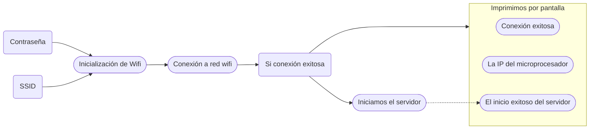

# Práctica 4. Gerard Cots y Joel J. Morera

## Generación de una página web

###### **Funcionamento**

El programa en cuestión consiste en utilizar el ESP32 como servidor para generar una página web a la qual podemos acceder mediante la IP del procesador.

Para ello, primero inicializamos la conexión WiFi a una red, especificando el SSID y la contrseña. Una vez establecida la conexión, inicializamos el servidor cuyo código HTML viene definido dentro del programa.

Respecto al serividor, cabe destacar que utilizamos el puerto 80, que esta asociado al protocolo de internet HTTP.

###### **Código del programa**

```cpp
#include <WiFi.h>
#include <WebServer.h>

// SSID & Password
const char* ssid = "*****"; // Enter your SSID here
const char* password = "*****"; //Enter your Password here

WebServer server(80);// Object of WebServer(HTTP port, 80 is default)

void setup() 
{
    Serial.begin(115200);
    Serial.println("Try Connecting to ");
    Serial.println(ssid);
    // Connect to your wi-fi modem
    WiFi.begin(ssid, password);
    // Check wi-fi is connected to wi-fi network
    while (WiFi.status() != WL_CONNECTED) 
    {
        delay(1000);
        Serial.print(".");
    }
    Serial.println("");
    Serial.println("WiFi connected successfully");
    Serial.print("Got IP: ");
    Serial.println(WiFi.localIP()); //Show ESP32 IP on serial
    server.on("/", handle_root);
    server.begin();
    Serial.println("HTTP server started");
    delay(100);
}

void loop() 
{
    server.handleClient();
}

// HTML & CSS contents which display on web server
String HTML = " <!DOCTYPE html>\
                <html>\
                    <body>\
                        <h1>My Primera Pagina con ESP32 - Station Mode &#128522;</h1>\
                    </body>\
                </html>";

// Handle root url (/)
void handle_root() 
{
    server.send(200, "text/html", HTML);
}
```

###### **Salida por terminal**

```bash
Try Connecting to 
MiFibra-F392
...
WiFi connected successfully
Got IP: 192.168.1.145
HTTP server started
```

###### **Visualización de la connexión a la página web**


###### **Diagrama de flujo**



## Communicación bluetooth

###### **Funcionamento**

El programa en cuestión realiza la tarea 

###### **Código** del programa

```cpp

//This example code is in the Public Domain (or CC0 licensed, at your option.)
//By Evandro Copercini - 2018
//
//This example creates a bridge between Serial and Classical Bluetooth (SPP)
//and also demonstrate that SerialBT have the same functionalities of a normal Serial

#include "BluetoothSerial.h"

#if !defined(CONFIG_BT_ENABLED) || !defined(CONFIG_BLUEDROID_ENABLED)
#error Bluetooth is not enabled! Please run `make menuconfig` to and enable it
#endif

BluetoothSerial SerialBT;

void setup()
{
    Serial.begin(115200);
    SerialBT.begin("ESP32test"); //Bluetooth device name
    Serial.println("The device started, now you can pair it with bluetooth!");
}
void loop()
{
    if (Serial.available()) 
    {
        SerialBT.write(Serial.read());
    }
    if (SerialBT.available())
    {
        Serial.write(SerialBT.read());
    }
    delay(20);
}
```

###### **Salida por terminal**

```bash
The device started, now you can pair it with bluetooth!
Hola 
Pruebas de conexión 1
Pruebas de conexión 2
Fin de la conexión 
```

###### **Diagrama de flujo**

## Generación página web realizando una conexión AP

###### **Funcionamento**

El programa en cuestión realiza la tarea 

###### **Código** del programa

```cpp
#include <WiFi.h>
#include <WebServer.h>

// SSID & Password
const char* ssid = "*****"; // Enter your SSID here
const char* password = "*****"; //Enter your Password here

WebServer server(80);// Object of WebServer(HTTP port, 80 is default)

void setup() 
{
    Serial.begin(115200);
    Serial.print("Try Connecting to ");
    Serial.println(ssid);
    // Connect to your wi-fi modem
    WiFi.begin(ssid, password);
    // Check wi-fi is connected to wi-fi network
    while (WiFi.status() != WL_CONNECTED) 
    {
        delay(1000);
        Serial.print(".");
    }
    Serial.println("");
    Serial.println("WiFi connected successfully");
    Serial.print("Got IP: ");
    Serial.println(WiFi.localIP()); //Show ESP32 IP on serial
    server.on("/", handle_root);
    server.begin();
    Serial.println("HTTP server started");
    delay(100);
}

void loop() 
{
    server.handleClient();
}

// HTML & CSS contents which display on web server
String HTML = " <!DOCTYPE html>\
                <html>\
                    <body>\
                        <h1>My Primera Pagina con ESP32 - Station Mode &#128522;</h1>\
                    </body>\
                </html>";

// Handle root url (/)
void handle_root() 
{
    server.send(200, "text/html", HTML);
}
```

###### **Salida por terminal**

```bash

```

###### **Visualización de la connexión a la página web**


###### **Diagrama de flujo**

## Bluetooth low energy (BLE)

###### **Funcionamento**

El programa en cuestión realiza la tarea 

###### **Código** del programa

```cpp
#include <BLEDevice.h>
#include <BLEUtils.h>
#include <BLEServer.h>

// See the following for generating UUIDs:
// https://www.uuidgenerator.net/

#define SERVICE_UUID        "4fafc201-1fb5-459e-8fcc-c5c9c331914b"
#define CHARACTERISTIC_UUID "beb5483e-36e1-4688-b7f5-ea07361b26a8"

void setup() {
  Serial.begin(115200);
  Serial.println("Starting BLE work!");

  BLEDevice::init("Long name works now");
  BLEServer *pServer = BLEDevice::createServer();
  BLEService *pService = pServer->createService(SERVICE_UUID);
  BLECharacteristic *pCharacteristic = pService->createCharacteristic(
                                         CHARACTERISTIC_UUID,
                                         BLECharacteristic::PROPERTY_READ |
                                         BLECharacteristic::PROPERTY_WRITE
                                       );

  pCharacteristic->setValue("Hello World says Neil");
  pService->start();
  // BLEAdvertising *pAdvertising = pServer->getAdvertising();  // this still is working for backward compatibility
  BLEAdvertising *pAdvertising = BLEDevice::getAdvertising();
  pAdvertising->addServiceUUID(SERVICE_UUID);
  pAdvertising->setScanResponse(true);
  pAdvertising->setMinPreferred(0x06);  // functions that help with iPhone connections issue
  pAdvertising->setMinPreferred(0x12);
  BLEDevice::startAdvertising();
  Serial.println("Characteristic defined! Now you can read it in your phone!");
}

void loop() {
  // put your main code here, to run repeatedly:
  delay(2000);
}
```

###### **Salida por terminal**

```bash

```

###### **Diagrama de flujo**