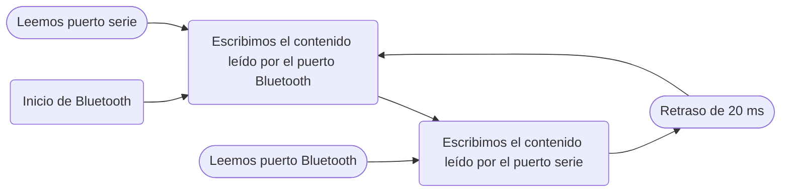
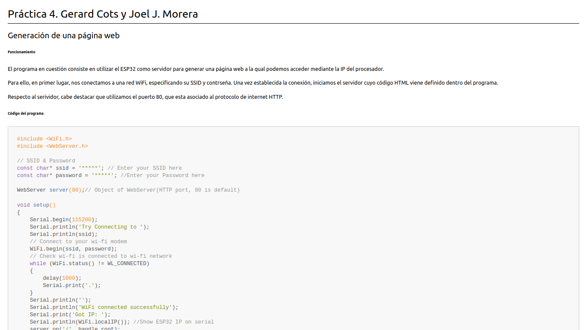
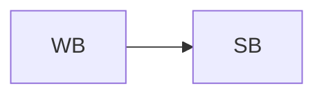
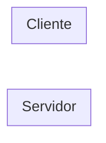

# Práctica 4. Gerard Cots y Joel J. Morera

## Generación de una página web

### Parte 1

###### **Funcionamiento**

El programa en cuestión consiste en utilizar el ESP32 como servidor para generar una página web a la qual podemos acceder mediante la IP del procesador.

Para ello, en primer lugar, nos conectamos a una red WiFi, especificando su SSID y contrseña. Una vez establecida la conexión, iniciamos el servidor cuyo código HTML viene definido dentro del programa.

Respecto al serividor, cabe destacar que utilizamos el puerto 80, que esta asociado al protocolo de internet HTTP.

###### **Código del programa**

```cpp
#include <WiFi.h>
#include <WebServer.h>

// SSID & Password
const char* ssid = "*****"; // Enter your SSID here
const char* password = "*****"; //Enter your Password here

WebServer server(80);// Object of WebServer(HTTP port, 80 is default)

void setup() 
{
    Serial.begin(115200);
    Serial.println("Try Connecting to ");
    Serial.println(ssid);
    // Connect to your wi-fi modem
    WiFi.begin(ssid, password);
    // Check wi-fi is connected to wi-fi network
    while (WiFi.status() != WL_CONNECTED) 
    {
        delay(1000);
        Serial.print(".");
    }
    Serial.println("");
    Serial.println("WiFi connected successfully");
    Serial.print("Got IP: ");
    Serial.println(WiFi.localIP()); //Show ESP32 IP on serial
    server.on("/", handle_root);
    server.begin();
    Serial.println("HTTP server started");
    delay(100);
}

void loop() 
{
    server.handleClient();
}

// HTML & CSS contents which display on web server
String HTML = " <!DOCTYPE html>\
                <html>\
                    <body>\
                        <h1>My Primera Pagina con ESP32 - Station Mode &#128522;</h1>\
                    </body>\
                </html>";

// Handle root url (/)
void handle_root() 
{
    server.send(200, "text/html", HTML);
}
```

###### **Salida por terminal**

```
Try Connecting to 
******
...
WiFi connected successfully
Got IP: 192.168.1.145
HTTP server started
```

###### **Visualización de la conexión a la página web**


###### **Diagrama de flujo**


### Parte 2

###### **Funcionamiento**

En la segunda parte de la primer ejercicio de la práctica, en lugar de mostrar simplemente un título en la página web, ahora aparecerá el código HTML de un fichero Markdown, cuyo contenido ha sido exportado a HTML, que aparece en `index.html`

###### **Código del programa**

```cpp
#include <WiFi.h>
#include <WebServer.h>

// SSID & Password
const char* ssid = "*****"; // Enter your SSID here
const char* password = "******"; //Enter your Password here

WebServer server(80);// Object of WebServer(HTTP port, 80 is default)

void handle_root();

void setup() 
{
    Serial.begin(115200);
    Serial.print("Try Connecting to ");
    Serial.println(ssid);
    // Connect to your wi-fi modem
    WiFi.begin(ssid, password);
    // Check wi-fi is connected to wi-fi network
    while (WiFi.status() != WL_CONNECTED) 
    {
        delay(1000);
        Serial.print(".");
    }
    Serial.println("");
    Serial.println("WiFi connected successfully");
    Serial.print("Got IP: ");
    Serial.println(WiFi.localIP()); //Show ESP32 IP on serial
    server.on("/", handle_root);
    server.begin();
    Serial.println("HTTP server started");
    delay(100);
}

void loop() 
{
    server.handleClient();
}

// HTML & CSS contents which display on web server
char* HTML = "<!DOCTYPE html>"
"<html>"
"<head>"
"<title>Página web con conexión STA</title>"
"<meta http-equiv='Content-type' content='text/html;charset=UTF-8'>"

"<style>"
"body {"
"	font-family: var(--vscode-markdown-font-family, -apple-system, BlinkMacSystemFont, 'Segoe WPC', 'Segoe UI', 'Ubuntu', 'Droid Sans', sans-serif);"
"	font-size: var(--vscode-markdown-font-size, 14px);"
"	padding: 0 26px;"
"	line-height: var(--vscode-markdown-line-height, 22px);"
"	word-wrap: break-word;"
"}"

"#code-csp-warning {"
"	position: fixed;"
"	top: 0;"
"	right: 0;"
"	color: white;"
"	margin: 16px;"
"	text-align: center;"
"	font-size: 12px;"
"	font-family: sans-serif;"
"	background-color:#444444;"
"	cursor: pointer;"
"	padding: 6px;"
"	box-shadow: 1px 1px 1px rgba(0,0,0,.25);"
"}"

"#code-csp-warning:hover {"
"	text-decoration: none;"
"	background-color:#007acc;"
"	box-shadow: 2px 2px 2px rgba(0,0,0,.25);"
"}"

"body.scrollBeyondLastLine {"
"	margin-bottom: calc(100vh - 22px);"
"}"

"body.showEditorSelection .code-line {"
"	position: relative;"
"}"

"body.showEditorSelection .code-active-line:before,"
"body.showEditorSelection .code-line:hover:before {"
"	content: '';"
"	display: block;"
"	position: absolute;"
"	top: 0;"
"	left: -12px;"
"	height: 100%;"
"}"

"body.showEditorSelection li.code-active-line:before,"
"body.showEditorSelection li.code-line:hover:before {"
"	left: -30px;"
"}"

".vscode-light.showEditorSelection .code-active-line:before {"
"	border-left: 3px solid rgba(0, 0, 0, 0.15);"
"}"

".vscode-light.showEditorSelection .code-line:hover:before {"
"	border-left: 3px solid rgba(0, 0, 0, 0.40);"
"}"

".vscode-light.showEditorSelection .code-line .code-line:hover:before {"
"	border-left: none;"
"}"

".vscode-dark.showEditorSelection .code-active-line:before {"
"	border-left: 3px solid rgba(255, 255, 255, 0.4);"
"}"

".vscode-dark.showEditorSelection .code-line:hover:before {"
"	border-left: 3px solid rgba(255, 255, 255, 0.60);"
"}"

".vscode-dark.showEditorSelection .code-line .code-line:hover:before {"
"	border-left: none;"
"}"

".vscode-high-contrast.showEditorSelection .code-active-line:before {"
"	border-left: 3px solid rgba(255, 160, 0, 0.7);"
"}"

".vscode-high-contrast.showEditorSelection .code-line:hover:before {"
"	border-left: 3px solid rgba(255, 160, 0, 1);"
"}"

".vscode-high-contrast.showEditorSelection .code-line .code-line:hover:before {"
"	border-left: none;"
"}"

"img {"
"	max-width: 100%;"
"	max-height: 100%;"
"}"

"a {"
"	text-decoration: none;"
"}"

"a:hover {"
"	text-decoration: underline;"
"}"

"a:focus,"
"input:focus,"
"select:focus,"
"textarea:focus {"
"	outline: 1px solid -webkit-focus-ring-color;"
"	outline-offset: -1px;"
"}"

"hr {"
"	border: 0;"
"	height: 2px;"
"	border-bottom: 2px solid;"
"}"

"h1 {"
"	padding-bottom: 0.3em;"
"	line-height: 1.2;"
"	border-bottom-width: 1px;"
"	border-bottom-style: solid;"
"}"

"h1, h2, h3 {"
"	font-weight: normal;"
"}"

"table {"
"	border-collapse: collapse;"
"}"

"table > thead > tr > th {"
"	text-align: left;"
"	border-bottom: 1px solid;"
"}"

"table > thead > tr > th,"
"table > thead > tr > td,"
"table > tbody > tr > th,"
"table > tbody > tr > td {"
"	padding: 5px 10px;"
"}"

"table > tbody > tr + tr > td {"
"	border-top: 1px solid;"
"}"

"blockquote {"
"	margin: 0 7px 0 5px;"
"	padding: 0 16px 0 10px;"
"	border-left-width: 5px;"
"	border-left-style: solid;"
"}"

"code {"
"	font-family: Menlo, Monaco, Consolas, 'Droid Sans Mono', 'Courier New', monospace, 'Droid Sans Fallback';"
"	font-size: 1em;"
"	line-height: 1.357em;"
"}"

"body.wordWrap pre {"
"	white-space: pre-wrap;"
"}"

"pre:not(.hljs),"
"pre.hljs code > div {"
"	padding: 16px;"
"	border-radius: 3px;"
"	overflow: auto;"
"}"

"pre code {"
"	color: var(--vscode-editor-foreground);"
"	tab-size: 4;"
"}"

".vscode-light pre {"
"	background-color: rgba(220, 220, 220, 0.4);"
"}"

".vscode-dark pre {"
"	background-color: rgba(10, 10, 10, 0.4);"
"}"

".vscode-high-contrast pre {"
"	background-color: rgb(0, 0, 0);"
"}"

".vscode-high-contrast h1 {"
"	border-color: rgb(0, 0, 0);"
"}"

".vscode-light table > thead > tr > th {"
"	border-color: rgba(0, 0, 0, 0.69);"
"}"

".vscode-dark table > thead > tr > th {"
"	border-color: rgba(255, 255, 255, 0.69);"
"}"

".vscode-light h1,"
".vscode-light hr,"
".vscode-light table > tbody > tr + tr > td {"
"	border-color: rgba(0, 0, 0, 0.18);"
"}"

".vscode-dark h1,"
".vscode-dark hr,"
".vscode-dark table > tbody > tr + tr > td {"
"	border-color: rgba(255, 255, 255, 0.18);"
"}"

"</style>"

"<style>"
".hljs-comment,"
".hljs-quote {"
"	color: #8e908c;"
"}"

".hljs-variable,"
".hljs-template-variable,"
".hljs-tag,"
".hljs-name,"
".hljs-selector-id,"
".hljs-selector-class,"
".hljs-regexp,"
".hljs-deletion {"
"	color: #c82829;"
"}"

".hljs-number,"
".hljs-built_in,"
".hljs-builtin-name,"
".hljs-literal,"
".hljs-type,"
".hljs-params,"
".hljs-meta,"
".hljs-link {"
"	color: #f5871f;"
"}"

".hljs-attribute {"
"	color: #eab700;"
"}"

".hljs-string,"
".hljs-symbol,"
".hljs-bullet,"
".hljs-addition {"
"	color: #718c00;"
"}"

".hljs-title,"
".hljs-section {"
"	color: #4271ae;"
"}"

".hljs-keyword,"
".hljs-selector-tag {"
"	color: #8959a8;"
"}"

".hljs {"
"	display: block;"
"	overflow-x: auto;"
"	color: #4d4d4c;"
"	padding: 0.5em;"
"}"

".hljs-emphasis {"
"	font-style: italic;"
"}"

".hljs-strong {"
"	font-weight: bold;"
"}"
"</style>"

"<style>"

" body {"
"	font-family: -apple-system, BlinkMacSystemFont, 'Segoe WPC', 'Segoe UI', 'Ubuntu', 'Droid Sans', sans-serif, 'Meiryo';"
"	padding: 0 12px;"
"}"

"pre {"
"	background-color: #f8f8f8;"
"	border: 1px solid #cccccc;"
"	border-radius: 3px;"
"	overflow-x: auto;"
"	white-space: pre-wrap;"
"	overflow-wrap: break-word;"
"}"

"pre:not(.hljs) {"
"	padding: 23px;"
"	line-height: 19px;"
"}"

"blockquote {"
"	background: rgba(127, 127, 127, 0.1);"
"	border-color: rgba(0, 122, 204, 0.5);"
"}"

".emoji {"
"	height: 1.4em;"
"}"

"code {"
"	font-size: 14px;"
"	line-height: 19px;"
"}"

":not(pre):not(.hljs) > code {"
"	color: #C9AE75;"
"	font-size: inherit;"
"}"

".page {"
"	page-break-after: always;"
"}"

"</style>"

"<script src='https://unpkg.com/mermaid/dist/mermaid.min.js'></script>"
"</head>"
"<body>"
"  <script>"
"    mermaid.initialize({"
"      startOnLoad: true,"
"      theme: document.body.classList.contains('vscode-dark') || document.body.classList.contains('vscode-high-contrast')"
"          ? 'dark'"
"          : 'default'"
"    });"
"  </script>"
"<h1 id='practica-4-gerard-cots-y-joel-j-morera'>Práctica 4. Gerard Cots y Joel J. Morera</h1>"
"<h2 id='generacion-de-una-pagina-web'>Generación de una página web</h2>"
"<h3 id='funcionamiento'><strong>Funcionamiento</strong></h3>"
"<p>El programa en cuestión consiste en utilizar el ESP32 como servidor para generar una página web a la qual podemos acceder mediante la IP del procesador.</p>"
"<p>Para ello, en primer lugar, nos conectamos a una red WiFi, especificando su SSID y contrseña. Una vez establecida la conexión, iniciamos el servidor cuyo código HTML viene definido dentro del programa.</p>"
"<p>Respecto al serividor, cabe destacar que utilizamos el puerto 80, que esta asociado al protocolo de internet HTTP.</p>"
"<h3 id='codigo-del-programa'><strong>Código del programa</strong></h3>"
"<pre class='hljs'><code><div><span class='hljs-meta'>#<span class='hljs-meta-keyword'>include</span> <span class='hljs-meta-string'>&lt;WiFi.h&gt;</span></span> \n"
"<span class='hljs-meta'>#<span class='hljs-meta-keyword'>include</span> <span class='hljs-meta-string'>&lt;WebServer.h&gt;</span></span> \n\n"

"<span class='hljs-comment'>// SSID &amp; Password</span> \n"
"<span class='hljs-keyword'>const</span> <span class='hljs-keyword'>char</span>* ssid = <span class='hljs-string'>'*****'</span>; <span class='hljs-comment'>// Enter your SSID here</span> \n"
"<span class='hljs-keyword'>const</span> <span class='hljs-keyword'>char</span>* password = <span class='hljs-string'>'*****'</span>; <span class='hljs-comment'>//Enter your Password here</span> \n\n"

"<span class='hljs-function'>WebServer <span class='hljs-title'>server</span><span class='hljs-params'>(<span class='hljs-number'>80</span>)</span></span>;<span class='hljs-comment'>// Object of WebServer(HTTP port, 80 is default)</span> \n\n"

"<span class='hljs-function'><span class='hljs-keyword'>void</span> <span class='hljs-title'>setup</span><span class='hljs-params'>()</span>  \n"
"</span>{ \n"
"    Serial.begin(<span class='hljs-number'>115200</span>); \n"
"    Serial.println(<span class='hljs-string'>'Try Connecting to '</span>); \n"
"    Serial.println(ssid); \n"
"    <span class='hljs-comment'>// Connect to your wi-fi modem</span> \n"
"    WiFi.begin(ssid, password); \n"
"    <span class='hljs-comment'>// Check wi-fi is connected to wi-fi network</span> \n"
"    <span class='hljs-keyword'>while</span> (WiFi.status() != WL_CONNECTED)  \n"
"    { \n"
"        delay(<span class='hljs-number'>1000</span>); \n"
"        Serial.print(<span class='hljs-string'>'.'</span>); \n"
"    } \n"
"    Serial.println(<span class='hljs-string'>''</span>); \n"
"    Serial.println(<span class='hljs-string'>'WiFi connected successfully'</span>); \n"
"    Serial.print(<span class='hljs-string'>'Got IP: '</span>); \n"
"    Serial.println(WiFi.localIP()); <span class='hljs-comment'>//Show ESP32 IP on serial</span> \n"
"    server.on(<span class='hljs-string'>'/'</span>, handle_root); \n"
"    server.begin(); \n"
"    Serial.println(<span class='hljs-string'>'HTTP server started'</span>); \n"
"    delay(<span class='hljs-number'>100</span>); \n"
"} \n\n"

"<span class='hljs-function'><span class='hljs-keyword'>void</span> <span class='hljs-title'>loop</span><span class='hljs-params'>()</span>  \n"
"</span>{ \n"
"    server.handleClient(); \n"
"} \n\n"

"<span class='hljs-comment'>// HTML &amp; CSS contents which display on web server \n</span>"
"String HTML = <span class='hljs-string'>' &lt;!DOCTYPE html&gt; \n"
"                &lt;html&gt; \n"
"                    &lt;body&gt; \n"
"                        &lt;h1&gt;My Primera Pagina con ESP32 - Station Mode &amp;#128522;&lt;/h1&gt; \n"
"                    &lt;/body&gt; \n"
"                &lt;/html&gt;'</span>; \n\n"

"<span class='hljs-comment'>// Handle root url (/) \n</span>"
"<span class='hljs-function'><span class='hljs-keyword'>void</span> <span class='hljs-title'>handle_root</span><span class='hljs-params'>() \n</span> "
"</span>{ \n"
"    server.send(<span class='hljs-number'>200</span>, <span class='hljs-string'>'text/html'</span>, HTML); \n"
"}"
"</div></code></pre>"
"<h3 id='salida-por-terminal'><strong>Salida por terminal</strong></h3>"
"<pre class='hljs'><code><div>Try Connecting to "
"****** \n"
"... \n"
"WiFi connected successfully \n"
"Got IP: 192.168.1.145 \n"
"HTTP server started"
"</div></code></pre>"
"<h3 id='visualizacion-de-la-conexion-a-la-pagina-web'><strong>Visualización de la conexión a la página web</strong></h3>"
""
"<h3 id='diagrama-de-flujo'><strong>Diagrama de flujo</strong></h3>"
"<pre><code class='language-mermaid'>"
"<div class='mermaid'>"
"    flowchart LR;"

"    pss('Contraseña') & ssid('SSID')--> WB;"

"    WB(['Inicialización de Wifi']) --> CW;"

"    CW(['Conexión a red wifi']) --> if;"

"    if('Si conexión exitosa') --> HS & SP;"

"    subgraph SP [Imprimimos por pantalla]"
"        ICW(['Conexión exitosa']);"
"        IIP(['La IP del microprocesador']);"
"        SI([El inicio exitoso del servidor]);"
"    end;"

"    HS(['Iniciamos el servidor']) -..-> SI;"
"</div></code></pre>"

"</body>"
"</html>";

// Handle root url (/)"
void handle_root()
{
    server.send(200, "text/html", HTML);
}
```

###### **Visualización de la conexión a la página web**


## Communicación Bluetooth Classic

###### **Funcionamiento**

El programa en cuestión consiste en usar *Bluetooth Classic* para comunicar el ESP32 con otro dispositivo.

Para ello, utilizamos la libreria `BluetoothSerial.h`, mediante esta habilitamos la conexión usando `SerialBT.begin("ESP32test")` siendo "ESP32test" el nombre con el que aparecera el dispositivo y `SerialBT` la variable creada con la libreria.

Una vez establecida la conexión, utilizando aplicaciones como `Serial Bluetooth Terminal` podemos escribir y leer texto. El procesador leerá el texto que escribamos en la terminal de la apliación y lo escribirá en el puerto serie. Seguidamente, leera el mensaje que aparece en el puerto serie, mandará los datos por Bluetooth y se escribiran en la terminal de la aplicación.

###### **Código del programa**

```cpp

//This example code is in the Public Domain (or CC0 licensed, at your option.)
//By Evandro Copercini - 2018
//
//This example creates a bridge between Serial and Classical Bluetooth (SPP)
//and also demonstrate that SerialBT have the same functionalities of a normal Serial

#include "BluetoothSerial.h"

#if !defined(CONFIG_BT_ENABLED) || !defined(CONFIG_BLUEDROID_ENABLED)
#error Bluetooth is not enabled! Please run `make menuconfig` to and enable it
#endif

BluetoothSerial SerialBT;

void setup()
{
    Serial.begin(115200);
    SerialBT.begin("ESP32test"); //Bluetooth device name
    Serial.println("The device started, now you can pair it with bluetooth!");
}
void loop()
{
    if (Serial.available()) 
    {
        SerialBT.write(Serial.read());
    }
    if (SerialBT.available())
    {
        Serial.write(SerialBT.read());
    }
    delay(20);
}
```

###### **Salida por terminal**

A continuación podemos ver los mensajes que aparecieron durante la ejecución del programa en el puerto serie. Todos estos mensajes se escribieron desde la aplicacion `Serial Bluetooth Terminal`, excepto el mensaje que informa del inicio del dispositivo.

```
The device started, now you can pair it with bluetooth!
Hola 
Pruebas de conexión 1
Pruebas de conexión 2
Fin de la conexión 
```

###### **Diagrama de flujo**



## Generación página web realizando un AP

###### **Funcionamiento**

El ESP32 puede trabajar de dos maneras, en lo que a WiFi se refiere, como estación de WiFi(*Wi-Fi Station*) o como punto de acceso(*Acces Point*). El primer tipo de conexión la hemos visto en el primer ejercicio, en este veremos el segundo tipo.

La principal diferencia entre las dos consiste en que ahora el ESP32 creara su propia red Wi-Fi a la que se pueden conectar dispositivos.

Por lo que, teniendo en cuenta este concepto, generaremos una página web a la cual solo se puede acceder connectandose a la red del ESP32.

### Parte 1 : Ejemplo de prueba

###### **Código del programa**

```cpp
// Load Wi-Fi library
#include <WiFi.h>

// HTML & CSS contents which display on web server
String HTML = " <!DOCTYPE html>\
                <html>\
                    <body>\
                        <h1>My Primera Pagina con ESP32 - Station Mode &#128522;</h1>\
                    </body>\
                </html>";

// Replace with your network credentials
const char* ssid     = "ESP32-Access-Point";
const char* password = "123456789";

// Set web server port number to 80
WiFiServer server(80);

// Auxiliar variables to store the current output state
String output26State = "off";
String output27State = "off";

// Assign output variables to GPIO pins
const int output26 = 26;
const int output27 = 27;

void setup() {
  Serial.begin(115200);

  // Connect to Wi-Fi network with SSID and password
  Serial.print("Setting AP (Access Point) ...");
  // Remove the password parameter, if you want the AP (Access Point) to be open
  WiFi.softAP(ssid, password);

  IPAddress IP = WiFi.softAPIP();
  Serial.print("AP IP address: ");
  Serial.println(IP);
  
  server.begin();
}

void loop() 
{
  WiFiClient client = server.available();   // Listen for incoming clients

  if (client) {                             // If a new client connects,
    Serial.println("New Client.");          // print a message out in the serial port
    String currentLine = "";                // make a String to hold incoming data from the client
    while (client.connected()) {            // loop while the client's connected
      if (client.available()) {                    // if the byte is a newline character
        // if the current line is blank, you got two newline characters in a row.
        // that's the end of the client HTTP request, so send a response:
        if (currentLine.length() == 0) {
          // HTTP headers always start with a response code (e.g. HTTP/1.1 200 OK)
          // and a content-type so the client knows what's coming, then a blank line:
          client.println("HTTP/1.1 200 OK");
          client.println("Content-type:text/html");
          client.println("Connection: close");
          client.println();
          
          // Display the HTML web page
          client.println(HTML);
          
          // The HTTP response ends with another blank line
          client.println();
          // Break out of the while loop
          break;
        } else { // if you got a newline, then clear currentLine
          currentLine = "";
        }
      }
    }
    // Close the connection
    client.stop();
    Serial.println("Client disconnected.");
    Serial.println("");
  }
}
```

###### **Visualización de la connexión a la página web**


### Parte 2: HTML de un fichero de Markdown

###### **Código del programa**

```cpp
// Load Wi-Fi library
#include <WiFi.h>

// HTML & CSS contents which display on web server
char* HTML = "<!DOCTYPE html>"
"<html>"
"<head>"
"<title>Página web con conexión STA</title>"
"<meta http-equiv='Content-type' content='text/html;charset=UTF-8'>"

"<style>"
"body {"
"	font-family: var(--vscode-markdown-font-family, -apple-system, BlinkMacSystemFont, 'Segoe WPC', 'Segoe UI', 'Ubuntu', 'Droid Sans', sans-serif);"
"	font-size: var(--vscode-markdown-font-size, 14px);"
"	padding: 0 26px;"
"	line-height: var(--vscode-markdown-line-height, 22px);"
"	word-wrap: break-word;"
"}"

"#code-csp-warning {"
"	position: fixed;"
"	top: 0;"
"	right: 0;"
"	color: white;"
"	margin: 16px;"
"	text-align: center;"
"	font-size: 12px;"
"	font-family: sans-serif;"
"	background-color:#444444;"
"	cursor: pointer;"
"	padding: 6px;"
"	box-shadow: 1px 1px 1px rgba(0,0,0,.25);"
"}"

"#code-csp-warning:hover {"
"	text-decoration: none;"
"	background-color:#007acc;"
"	box-shadow: 2px 2px 2px rgba(0,0,0,.25);"
"}"

"body.scrollBeyondLastLine {"
"	margin-bottom: calc(100vh - 22px);"
"}"

"body.showEditorSelection .code-line {"
"	position: relative;"
"}"

"body.showEditorSelection .code-active-line:before,"
"body.showEditorSelection .code-line:hover:before {"
"	content: '';"
"	display: block;"
"	position: absolute;"
"	top: 0;"
"	left: -12px;"
"	height: 100%;"
"}"

"body.showEditorSelection li.code-active-line:before,"
"body.showEditorSelection li.code-line:hover:before {"
"	left: -30px;"
"}"

".vscode-light.showEditorSelection .code-active-line:before {"
"	border-left: 3px solid rgba(0, 0, 0, 0.15);"
"}"

".vscode-light.showEditorSelection .code-line:hover:before {"
"	border-left: 3px solid rgba(0, 0, 0, 0.40);"
"}"

".vscode-light.showEditorSelection .code-line .code-line:hover:before {"
"	border-left: none;"
"}"

".vscode-dark.showEditorSelection .code-active-line:before {"
"	border-left: 3px solid rgba(255, 255, 255, 0.4);"
"}"

".vscode-dark.showEditorSelection .code-line:hover:before {"
"	border-left: 3px solid rgba(255, 255, 255, 0.60);"
"}"

".vscode-dark.showEditorSelection .code-line .code-line:hover:before {"
"	border-left: none;"
"}"

".vscode-high-contrast.showEditorSelection .code-active-line:before {"
"	border-left: 3px solid rgba(255, 160, 0, 0.7);"
"}"

".vscode-high-contrast.showEditorSelection .code-line:hover:before {"
"	border-left: 3px solid rgba(255, 160, 0, 1);"
"}"

".vscode-high-contrast.showEditorSelection .code-line .code-line:hover:before {"
"	border-left: none;"
"}"

"img {"
"	max-width: 100%;"
"	max-height: 100%;"
"}"

"a {"
"	text-decoration: none;"
"}"

"a:hover {"
"	text-decoration: underline;"
"}"

"a:focus,"
"input:focus,"
"select:focus,"
"textarea:focus {"
"	outline: 1px solid -webkit-focus-ring-color;"
"	outline-offset: -1px;"
"}"

"hr {"
"	border: 0;"
"	height: 2px;"
"	border-bottom: 2px solid;"
"}"

"h1 {"
"	padding-bottom: 0.3em;"
"	line-height: 1.2;"
"	border-bottom-width: 1px;"
"	border-bottom-style: solid;"
"}"

"h1, h2, h3 {"
"	font-weight: normal;"
"}"

"table {"
"	border-collapse: collapse;"
"}"

"table > thead > tr > th {"
"	text-align: left;"
"	border-bottom: 1px solid;"
"}"

"table > thead > tr > th,"
"table > thead > tr > td,"
"table > tbody > tr > th,"
"table > tbody > tr > td {"
"	padding: 5px 10px;"
"}"

"table > tbody > tr + tr > td {"
"	border-top: 1px solid;"
"}"

"blockquote {"
"	margin: 0 7px 0 5px;"
"	padding: 0 16px 0 10px;"
"	border-left-width: 5px;"
"	border-left-style: solid;"
"}"

"code {"
"	font-family: Menlo, Monaco, Consolas, 'Droid Sans Mono', 'Courier New', monospace, 'Droid Sans Fallback';"
"	font-size: 1em;"
"	line-height: 1.357em;"
"}"

"body.wordWrap pre {"
"	white-space: pre-wrap;"
"}"

"pre:not(.hljs),"
"pre.hljs code > div {"
"	padding: 16px;"
"	border-radius: 3px;"
"	overflow: auto;"
"}"

"pre code {"
"	color: var(--vscode-editor-foreground);"
"	tab-size: 4;"
"}"

".vscode-light pre {"
"	background-color: rgba(220, 220, 220, 0.4);"
"}"

".vscode-dark pre {"
"	background-color: rgba(10, 10, 10, 0.4);"
"}"

".vscode-high-contrast pre {"
"	background-color: rgb(0, 0, 0);"
"}"

".vscode-high-contrast h1 {"
"	border-color: rgb(0, 0, 0);"
"}"

".vscode-light table > thead > tr > th {"
"	border-color: rgba(0, 0, 0, 0.69);"
"}"

".vscode-dark table > thead > tr > th {"
"	border-color: rgba(255, 255, 255, 0.69);"
"}"

".vscode-light h1,"
".vscode-light hr,"
".vscode-light table > tbody > tr + tr > td {"
"	border-color: rgba(0, 0, 0, 0.18);"
"}"

".vscode-dark h1,"
".vscode-dark hr,"
".vscode-dark table > tbody > tr + tr > td {"
"	border-color: rgba(255, 255, 255, 0.18);"
"}"

"</style>"

"<style>"
".hljs-comment,"
".hljs-quote {"
"	color: #8e908c;"
"}"

".hljs-variable,"
".hljs-template-variable,"
".hljs-tag,"
".hljs-name,"
".hljs-selector-id,"
".hljs-selector-class,"
".hljs-regexp,"
".hljs-deletion {"
"	color: #c82829;"
"}"

".hljs-number,"
".hljs-built_in,"
".hljs-builtin-name,"
".hljs-literal,"
".hljs-type,"
".hljs-params,"
".hljs-meta,"
".hljs-link {"
"	color: #f5871f;"
"}"

".hljs-attribute {"
"	color: #eab700;"
"}"

".hljs-string,"
".hljs-symbol,"
".hljs-bullet,"
".hljs-addition {"
"	color: #718c00;"
"}"

".hljs-title,"
".hljs-section {"
"	color: #4271ae;"
"}"

".hljs-keyword,"
".hljs-selector-tag {"
"	color: #8959a8;"
"}"

".hljs {"
"	display: block;"
"	overflow-x: auto;"
"	color: #4d4d4c;"
"	padding: 0.5em;"
"}"

".hljs-emphasis {"
"	font-style: italic;"
"}"

".hljs-strong {"
"	font-weight: bold;"
"}"
"</style>"

"<style>"

" body {"
"	font-family: -apple-system, BlinkMacSystemFont, 'Segoe WPC', 'Segoe UI', 'Ubuntu', 'Droid Sans', sans-serif, 'Meiryo';"
"	padding: 0 12px;"
"}"

"pre {"
"	background-color: #f8f8f8;"
"	border: 1px solid #cccccc;"
"	border-radius: 3px;"
"	overflow-x: auto;"
"	white-space: pre-wrap;"
"	overflow-wrap: break-word;"
"}"

"pre:not(.hljs) {"
"	padding: 23px;"
"	line-height: 19px;"
"}"

"blockquote {"
"	background: rgba(127, 127, 127, 0.1);"
"	border-color: rgba(0, 122, 204, 0.5);"
"}"

".emoji {"
"	height: 1.4em;"
"}"

"code {"
"	font-size: 14px;"
"	line-height: 19px;"
"}"

":not(pre):not(.hljs) > code {"
"	color: #C9AE75;"
"	font-size: inherit;"
"}"

".page {"
"	page-break-after: always;"
"}"

"</style>"

"<script src='https://unpkg.com/mermaid/dist/mermaid.min.js'></script>"
"</head>"
"<body>"
"  <script>"
"    mermaid.initialize({"
"      startOnLoad: true,"
"      theme: document.body.classList.contains('vscode-dark') || document.body.classList.contains('vscode-high-contrast')"
"          ? 'dark'"
"          : 'default'"
"    });"
"  </script>"
"<h1 id='practica-4-gerard-cots-y-joel-j-morera'>Práctica 4. Gerard Cots y Joel J. Morera</h1>"
"<h2 id='generacion-de-una-pagina-web'>Generación de una página web</h2>"
"<h3 id='funcionamiento'><strong>Funcionamiento</strong></h3>"
"<p>El programa en cuestión consiste en utilizar el ESP32 como servidor para generar una página web a la qual podemos acceder mediante la IP del procesador.</p>"
"<p>Para ello, en primer lugar, nos conectamos a una red WiFi, especificando su SSID y contrseña. Una vez establecida la conexión, iniciamos el servidor cuyo código HTML viene definido dentro del programa.</p>"
"<p>Respecto al serividor, cabe destacar que utilizamos el puerto 80, que esta asociado al protocolo de internet HTTP.</p>"
"<h3 id='codigo-del-programa'><strong>Código del programa</strong></h3>"
"<pre class='hljs'><code><div><span class='hljs-meta'>#<span class='hljs-meta-keyword'>include</span> <span class='hljs-meta-string'>&lt;WiFi.h&gt;</span></span> \n"
"<span class='hljs-meta'>#<span class='hljs-meta-keyword'>include</span> <span class='hljs-meta-string'>&lt;WebServer.h&gt;</span></span> \n\n"

"<span class='hljs-comment'>// SSID &amp; Password</span> \n"
"<span class='hljs-keyword'>const</span> <span class='hljs-keyword'>char</span>* ssid = <span class='hljs-string'>'*****'</span>; <span class='hljs-comment'>// Enter your SSID here</span> \n"
"<span class='hljs-keyword'>const</span> <span class='hljs-keyword'>char</span>* password = <span class='hljs-string'>'*****'</span>; <span class='hljs-comment'>//Enter your Password here</span> \n\n"

"<span class='hljs-function'>WebServer <span class='hljs-title'>server</span><span class='hljs-params'>(<span class='hljs-number'>80</span>)</span></span>;<span class='hljs-comment'>// Object of WebServer(HTTP port, 80 is default)</span> \n\n"

"<span class='hljs-function'><span class='hljs-keyword'>void</span> <span class='hljs-title'>setup</span><span class='hljs-params'>()</span>  \n"
"</span>{ \n"
"    Serial.begin(<span class='hljs-number'>115200</span>); \n"
"    Serial.println(<span class='hljs-string'>'Try Connecting to '</span>); \n"
"    Serial.println(ssid); \n"
"    <span class='hljs-comment'>// Connect to your wi-fi modem</span> \n"
"    WiFi.begin(ssid, password); \n"
"    <span class='hljs-comment'>// Check wi-fi is connected to wi-fi network</span> \n"
"    <span class='hljs-keyword'>while</span> (WiFi.status() != WL_CONNECTED)  \n"
"    { \n"
"        delay(<span class='hljs-number'>1000</span>); \n"
"        Serial.print(<span class='hljs-string'>'.'</span>); \n"
"    } \n"
"    Serial.println(<span class='hljs-string'>''</span>); \n"
"    Serial.println(<span class='hljs-string'>'WiFi connected successfully'</span>); \n"
"    Serial.print(<span class='hljs-string'>'Got IP: '</span>); \n"
"    Serial.println(WiFi.localIP()); <span class='hljs-comment'>//Show ESP32 IP on serial</span> \n"
"    server.on(<span class='hljs-string'>'/'</span>, handle_root); \n"
"    server.begin(); \n"
"    Serial.println(<span class='hljs-string'>'HTTP server started'</span>); \n"
"    delay(<span class='hljs-number'>100</span>); \n"
"} \n\n"

"<span class='hljs-function'><span class='hljs-keyword'>void</span> <span class='hljs-title'>loop</span><span class='hljs-params'>()</span>  \n"
"</span>{ \n"
"    server.handleClient(); \n"
"} \n\n"

"<span class='hljs-comment'>// HTML &amp; CSS contents which display on web server \n</span>"
"String HTML = <span class='hljs-string'>' &lt;!DOCTYPE html&gt; \n"
"                &lt;html&gt; \n"
"                    &lt;body&gt; \n"
"                        &lt;h1&gt;My Primera Pagina con ESP32 - Station Mode &amp;#128522;&lt;/h1&gt; \n"
"                    &lt;/body&gt; \n"
"                &lt;/html&gt;'</span>; \n\n"

"<span class='hljs-comment'>// Handle root url (/) \n</span>"
"<span class='hljs-function'><span class='hljs-keyword'>void</span> <span class='hljs-title'>handle_root</span><span class='hljs-params'>() \n</span> "
"</span>{ \n"
"    server.send(<span class='hljs-number'>200</span>, <span class='hljs-string'>'text/html'</span>, HTML); \n"
"}"
"</div></code></pre>"
"<h3 id='salida-por-terminal'><strong>Salida por terminal</strong></h3>"
"<pre class='hljs'><code><div>Try Connecting to "
"****** \n"
"... \n"
"WiFi connected successfully \n"
"Got IP: 192.168.1.145 \n"
"HTTP server started"
"</div></code></pre>"
"<h3 id='visualizacion-de-la-conexion-a-la-pagina-web'><strong>Visualización de la conexión a la página web</strong></h3>"
""
"<h3 id='diagrama-de-flujo'><strong>Diagrama de flujo</strong></h3>"
"<pre><code class='language-mermaid'>"
"<div class='mermaid'>"
"    flowchart LR;"

"    pss('Contraseña') & ssid('SSID')--> WB;"

"    WB(['Inicialización de Wifi']) --> CW;"

"    CW(['Conexión a red wifi']) --> if;"

"    if('Si conexión exitosa') --> HS & SP;"

"    subgraph SP [Imprimimos por pantalla]"
"        ICW(['Conexión exitosa']);"
"        IIP(['La IP del microprocesador']);"
"        SI([El inicio exitoso del servidor]);"
"    end;"

"    HS(['Iniciamos el servidor']) -..-> SI;"
"</div></code></pre>"

"</body>"
"</html>";

// Replace with your network credentials
const char* ssid     = "ESP32-Access-Point";
const char* password = "123456789";

// Set web server port number to 80
WiFiServer server(80);

// Auxiliar variables to store the current output state
String output26State = "off";
String output27State = "off";

// Assign output variables to GPIO pins
const int output26 = 26;
const int output27 = 27;

void setup() {
  Serial.begin(115200);

  // Connect to Wi-Fi network with SSID and password
  Serial.print("Setting AP (Access Point) ...");
  // Remove the password parameter, if you want the AP (Access Point) to be open
  WiFi.softAP(ssid, password);

  IPAddress IP = WiFi.softAPIP();
  Serial.print("AP IP address: ");
  Serial.println(IP);
  
  server.begin();
}

void loop() 
{
  WiFiClient client = server.available();   // Listen for incoming clients

  if (client) {                             // If a new client connects,
    Serial.println("New Client.");          // print a message out in the serial port
    String currentLine = "";                // make a String to hold incoming data from the client
    while (client.connected()) {            // loop while the client's connected
      if (client.available()) {                    // if the byte is a newline character
        // if the current line is blank, you got two newline characters in a row.
        // that's the end of the client HTTP request, so send a response:
        if (currentLine.length() == 0) {
          // HTTP headers always start with a response code (e.g. HTTP/1.1 200 OK)
          // and a content-type so the client knows what's coming, then a blank line:
          client.println("HTTP/1.1 200 OK");
          client.println("Content-type:text/html");
          client.println("Connection: close");
          client.println();
          
          // Display the HTML web page
          client.println(HTML);
          
          // The HTTP response ends with another blank line
          client.println();
          // Break out of the while loop
          break;
        } else { // if you got a newline, then clear currentLine
          currentLine = "";
        }
      }
    }
    // Close the connection
    client.stop();
    Serial.println("Client disconnected.");
    Serial.println("");
  }
}
```

###### **Visualización de la connexión a la página web**

<!--  -->


###### **Salida por terminal**

```
AP IP address: 192.168.4.1
New Client.
Client disconnected.

New Client.
Client disconnected.
```

###### **Diagrama de flujo**


## Bluetooth low energy (BLE)

###### **Funcionamiento**

El *Bluetooth low energy* consiste en una variente del *Bluetooth* que consume menos energia mediante el uso de paquetes de datos más pequeños, además, permanece suspendido hasta que se inicializa la conexión.

En *BLE*, tenemos dos tipos de dispositivos: el cliente y el servidor. El servidor emite una señal con tal que los clientes puedan encontrarlo y leer sus datos. Por lo que el cliente esta a la esucha de servidores y cuando encuentra el que esta buscando lee la información de este.

Por lo que, en este ejercicio, aparecen dos códigos, uno del servidor y otro del cliente.

###### **Código del servidor**

```cpp
/*
    Based on Neil Kolban example for IDF: https://github.com/nkolban/esp32-snippets/blob/master/cpp_utils/tests/BLE%20Tests/SampleServer.cpp
    Ported to Arduino ESP32 by Evandro Copercini
    updates by chegewara
*/

#include <BLEDevice.h>
#include <BLEUtils.h>
#include <BLEServer.h>

// See the following for generating UUIDs:
// https://www.uuidgenerator.net/

#define SERVICE_UUID        "4fafc201-1fb5-459e-8fcc-c5c9c331914b"
#define CHARACTERISTIC_UUID "beb5483e-36e1-4688-b7f5-ea07361b26a8"

void setup() {
  Serial.begin(115200);
  Serial.println("Starting BLE work!");

  BLEDevice::init("Long name works now");
  BLEServer *pServer = BLEDevice::createServer();
  BLEService *pService = pServer->createService(SERVICE_UUID);
  BLECharacteristic *pCharacteristic = pService->createCharacteristic(
                                         CHARACTERISTIC_UUID,
                                         BLECharacteristic::PROPERTY_READ |
                                         BLECharacteristic::PROPERTY_WRITE
                                       );

  pCharacteristic->setValue("Hello World says Neil");
  pService->start();
  // BLEAdvertising *pAdvertising = pServer->getAdvertising();  // this still is working for backward compatibility
  BLEAdvertising *pAdvertising = BLEDevice::getAdvertising();
  pAdvertising->addServiceUUID(SERVICE_UUID);
  pAdvertising->setScanResponse(true);
  pAdvertising->setMinPreferred(0x06);  // functions that help with iPhone connections issue
  pAdvertising->setMinPreferred(0x12);
  BLEDevice::startAdvertising();
  Serial.println("Characteristic defined! Now you can read it in your phone!");
}

void loop() {
  // put your main code here, to run repeatedly:
  delay(2000);
}
```

###### **Código del cliente**

```cpp
/*
   Based on Neil Kolban example for IDF: https://github.com/nkolban/esp32-snippets/blob/master/cpp_utils/tests/BLE%20Tests/SampleScan.cpp
   Ported to Arduino ESP32 by Evandro Copercini
*/

#include <BLEDevice.h>
#include <BLEUtils.h>
#include <BLEScan.h>
#include <BLEAdvertisedDevice.h>

int scanTime = 5; //In seconds
BLEScan* pBLEScan;

class MyAdvertisedDeviceCallbacks: public BLEAdvertisedDeviceCallbacks {
    void onResult(BLEAdvertisedDevice advertisedDevice) {
      Serial.printf("Advertised Device: %s \n", advertisedDevice.toString().c_str());
    }
};

void setup() {
  Serial.begin(115200);
  Serial.println("Scanning...");

  BLEDevice::init("");
  pBLEScan = BLEDevice::getScan(); //create new scan
  pBLEScan->setAdvertisedDeviceCallbacks(new MyAdvertisedDeviceCallbacks());
  pBLEScan->setActiveScan(true); //active scan uses more power, but get results faster
  pBLEScan->setInterval(100);
  pBLEScan->setWindow(99);  // less or equal setInterval value
}

void loop() {
  // put your main code here, to run repeatedly:
  BLEScanResults foundDevices = pBLEScan->start(scanTime, false);
  Serial.print("Devices found: ");
  Serial.println(foundDevices.getCount());
  Serial.println("Scan done!");
  pBLEScan->clearResults();   // delete results fromBLEScan buffer to release memory
  delay(2000);
}
```

###### **Salida por terminal**

```bash

```

###### **Diagrama de flujo**

