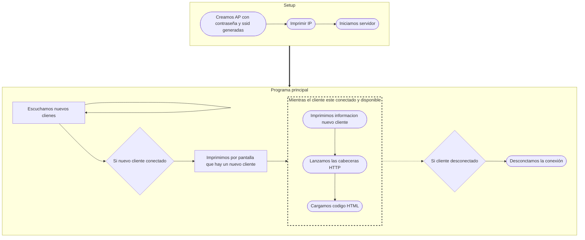

# Práctica 4. Gerard Cots y Joel J. Morera

## Generación de una página web

### Parte 1 : Ejemplo de prueba

###### **Funcionamiento**

El programa en cuestión consiste en utilizar el ESP32 como servidor para generar una página web a la qual podemos acceder mediante la IP del procesador.

Para ello, en primer lugar, nos conectamos a una red Wi-Fi, especificando su SSID y contrseña. Una vez establecida la conexión, iniciamos el servidor cuyo código HTML viene definido dentro del programa.

Respecto al servidor, cabe destacar que utilizamos el puerto 80, que esta asociado al protocolo de internet HTTP.

###### **Código del programa**

```cpp
#include <WiFi.h>
#include <WebServer.h>

// SSID & Password
const char* ssid = "*****"; // Enter your SSID here
const char* password = "*****"; //Enter your Password here

WebServer server(80);// Object of WebServer(HTTP port, 80 is default)

void handle_root();//Function definition

void setup() 
{
    Serial.begin(115200);
    Serial.print("Try Connecting to ");
    Serial.println(ssid);
    // Connect to your wi-fi modem
    WiFi.begin(ssid, password);
    // Check wi-fi is connected to wi-fi network
    while (WiFi.status() != WL_CONNECTED) 
    {
        delay(1000);
        Serial.print(".");
    }
    Serial.println("");
    Serial.println("WiFi connected successfully");
    Serial.print("Got IP: ");
    Serial.println(WiFi.localIP()); //Show ESP32 IP on serial
    server.on("/", handle_root);
    server.begin();
    Serial.println("HTTP server started");
    delay(100);
}

void loop() 
{
    server.handleClient();
}

// HTML & CSS contents which display on web server
String HTML = " <!DOCTYPE html>\
                <html>\
                    <body>\
                        <h1>My Primera Pagina con ESP32 - Station Mode &#128522;</h1>\
                    </body>\
                </html>";

// Handle root url (/)
void handle_root() 
{
    server.send(200, "text/html", HTML);
}
```

###### **Salida por terminal**

```
Try Connecting to ******
...
WiFi connected successfully
Got IP: 192.168.1.145
HTTP server started
```

###### **Visualización de la conexión a la página web**


###### **Diagrama de flujo**


### Parte 2 : HTML de un fichero de Markdown

###### **Funcionamiento**

En la segunda parte de la primer ejercicio de la práctica, en lugar de mostrar simplemente un título en la página web, ahora aparecerá el código HTML de un fichero Markdown, cuyo contenido ha sido exportado en `index.html`.

###### **Código del programa**

```cpp
#include <WiFi.h>
#include <WebServer.h>

extern String HTML;

// SSID & Password
const char* ssid = "*******"; // Enter your SSID here
const char* password = "********"; //Enter your Password here

WebServer server(80);// Object of WebServer(HTTP port, 80 is default)

void handle_root();

void setup() 
{
    Serial.begin(115200);
    Serial.print("Try Connecting to ");
    Serial.println(ssid);
    // Connect to your wi-fi modem
    WiFi.begin(ssid, password);
    // Check wi-fi is connected to wi-fi network
    while (WiFi.status() != WL_CONNECTED) 
    {
        delay(1000);
        Serial.print(".");
    }
    Serial.println("");
    Serial.println("WiFi connected successfully");
    Serial.print("Got IP: ");
    Serial.println(WiFi.localIP()); //Show ESP32 IP on serial
    server.on("/", handle_root);
    server.begin();
    Serial.println("HTTP server started");
    delay(100);
}

void loop() 
{
    server.handleClient();
}

void handle_root() 
{
    server.send(200, "text/html", HTML);
}
```

> **Nota:** El texto del fichero HTML aparece dentro de un `string` en el fichero `index.cpp` y en el fichero principal se hace referencia a él mediante la línea de código: `extern String HTML`.

###### **Visualización de la conexión a la página web**


## Comunicación Bluetooth Classic

###### **Funcionamiento**

El programa en cuestión consiste en usar *Bluetooth Classic* para comunicar el ESP32 con otro dispositivo.

Para ello, utilizamos la libreria `BluetoothSerial.h`, mediante esta habilitamos la conexión usando `SerialBT.begin("ESP32test")` siendo `ESP32test` el nombre con el que aparece el dispositivo y `SerialBT` la variable creada con la libreria.

Una vez establecida la conexión, utilizando aplicaciones como `Serial Bluetooth Terminal` podemos escribir y leer texto en una terminal conectada al ESP32 mediante *Bluetooth*. El procesador leerá el texto que escribamos en la terminal de la apliación y lo escribirá en el puerto serie. Seguidamente, leera el mensaje que aparece en el puerto serie, enviará los datos al dispositivo  y se escribirán en la terminal de la aplicación.

###### **Código del programa**

```cpp
#include "BluetoothSerial.h"

#if !defined(CONFIG_BT_ENABLED) || !defined(CONFIG_BLUEDROID_ENABLED)
#error Bluetooth is not enabled! Please run `make menuconfig` to and enable it
#endif

BluetoothSerial SerialBT;

void setup()
{
    Serial.begin(115200);
    SerialBT.begin("ESP32test"); //Bluetooth device name
    Serial.println("The device started, now you can pair it with bluetooth!");
}
void loop()
{
    if (Serial.available()) 
    {
        SerialBT.write(Serial.read());
    }
    if (SerialBT.available())
    {
        Serial.write(SerialBT.read());
    }
    delay(20);
}
```

###### **Salida por terminal**

```
The device started, now you can pair it with bluetooth!
Hola 
Pruebas de conexión 1
Pruebas de conexión 2
Fin de la conexión 
```

> **Nota:** Estos son los mensajes que aparecieron durante la ejecución del programa en el puerto serie. Todos estos mensajes se escribieron desde la aplicacion `Serial Bluetooth Terminal`, excepto el mensaje que informa del inicio del dispositivo.

###### **Diagrama de flujo**


## Generación página web mediante un AP

###### **Funcionamiento**

El ESP32 puede trabajar de dos maneras, en lo que a Wi-Fi se refiere, como estación de Wi-Fi (*Wi-Fi Station*) o como punto de acceso (*Acces Point*). El primer tipo de conexión la hemos visto en el primer ejercicio, en este veremos el segundo tipo.

La principal diferencia entre las dos consiste en que ahora el ESP32 creara su propia red Wi-Fi. Por lo que,  si generaremos una página web solo los dispositivos que esten conectados  a la red del ESP32 la podran ver.

### Parte 1 : Ejemplo de prueba

###### **Código del programa**

```cpp
// Load Wi-Fi library
#include <WiFi.h>

// HTML & CSS contents which display on web server
String HTML = " <!DOCTYPE html>\
                <html>\
                    <body>\
                        <h1>My Primera Pagina con ESP32 - AP Mode &#128522;</h1>\
                    </body>\
                </html>";

// Replace with your network credentials
const char* ssid     = "ESP32-Access-Point";
const char* password = "123456789";

// Set web server port number to 80
WiFiServer server(80);

void setup() {
  Serial.begin(115200);

  // Connect to Wi-Fi network with SSID and password
  Serial.print("Setting AP (Access Point) ...");
  // Remove the password parameter, if you want the AP (Access Point) to be open
  WiFi.softAP(ssid, password);

  IPAddress IP = WiFi.softAPIP();
  Serial.print("AP IP address: ");
  Serial.println(IP);
  
  server.begin();
}

void loop() 
{
  WiFiClient client = server.available();   // Listen for incoming clients

  if (client) {                             // If a new client connects,
    Serial.println("New Client.");          // print a message out in the serial port
    String currentLine = "";                // make a String to hold incoming data from the client
    while (client.connected()) {            // loop while the client's connected
      if (client.available()) {             // if the byte is a newline character
        char c = client.read();
         Serial.write(c);
        // if the current line is blank, you got two newline characters in a row.
        // that's the end of the client HTTP request, so send a response:
        if (currentLine.length() == 0) {
          // HTTP headers always start with a response code (e.g. HTTP/1.1 200 OK)
          // and a content-type so the client knows what's coming, then a blank line:
          client.println("HTTP/1.1 200 OK");
          client.println("Content-type:text/html");
          client.println("Connection: close");
          client.println();
          
          // Display the HTML web page
          client.println(HTML);
          
          // The HTTP response ends with another blank line
          client.println();
          // Break out of the while loop
          break;
        } else { // if you got a newline, then clear currentLine
          currentLine = "";
        }
      }
    }
    // Close the connection
    client.stop();
    Serial.println("Client disconnected.");
    Serial.println("");
  }
}
```

###### **Visualización de la conexión a la página web**


### Parte 2: HTML de un fichero de Markdown

###### **Código del programa**

```cpp
// Load Wi-Fi library
#include <WiFi.h>

// HTML & CSS contents which display on web server
extern String HTML;

// Replace with your network credentials
const char* ssid     = "ESP32-Access-Point";
const char* password = "123456789";

// Set web server port number to 80
WiFiServer server(80);

void setup() {
  Serial.begin(115200);

  // Connect to Wi-Fi network with SSID and password
  Serial.print("Setting AP (Access Point) ...");
  // Remove the password parameter, if you want the AP (Access Point) to be open
  WiFi.softAP(ssid, password);

  IPAddress IP = WiFi.softAPIP();
  Serial.print("AP IP address: ");
  Serial.println(IP);
  
  server.begin();
}

void loop() 
{
  WiFiClient client = server.available();   // Listen for incoming clients

  if (client) {                             // If a new client connects,
    Serial.println("New Client.");          // print a message out in the serial port
    String currentLine = "";                // make a String to hold incoming data from the client
    while (client.connected()) {            // loop while the client's connected
      if (client.available()) { 
        char c = client.read();
        Serial.write(c);
        // if the current line is blank, you got two newline characters in a row.
        // that's the end of the client HTTP request, so send a response:
        if (currentLine.length() == 0) {
          // HTTP headers always start with a response code (e.g. HTTP/1.1 200 OK)
          // and a content-type so the client knows what's coming, then a blank line:
          client.println("HTTP/1.1 200 OK");
          client.println("Content-type:text/html");
          client.println("Connection: close");
          client.println();
          
          // Display the HTML web page
          client.println(HTML);
          
          // The HTTP response ends with another blank line
          client.println();
          // Break out of the while loop
          break;
        } else { // if you got a newline, then clear currentLine
          currentLine = "";
        }
      }
    }
    // Close the connection
    client.stop();
    Serial.println("Client disconnected.");
    Serial.println("");
  }
}
```

> **Nota:** El texto del fichero HTML aparece dentro de un `string` en el fichero `index.cpp` y en el fichero principal se hace referencia a él mediante la línea de código: `extern String HTML`.

###### **Visualización de la conexión a la página web**


###### **Salida por terminal**

```
AP IP address: 192.168.4.1
New Client.
<Add client data>
Client disconnected.

New Client.
<Add client data>
Client disconnected.
```

###### **Diagrama de flujo**



### Parte 3 : Encendido de LEDs por Wi-Fi

###### **Funcionamiento**

El código en cuestión consiste en crear una página web, a la que podemos acceder conectandonos a la red Wi-Fi del procesador, en la que podemos controlar el encendido y apagado de dos LEDs.

Para ello, dentro del codigo HTML definimos dos botones con dos estados, _ON_ y _OFF_, cada vez que se pulsen los botones se hara referencia a un _header_ del tipo `/<pin del boton>/<estado del LED>`, como por ejemplo `/26/on`, en función de la cabecera o _header_ lanzaremos la orden de poner el pin del LED al valor que se requiera.

###### **Código del programa**
```cpp
// Load Wi-Fi library
#include <WiFi.h>

// Replace with your network credentials
const char* ssid     = "ESP32-Access-Point";
const char* password = "123456789";

// Set web server port number to 80
WiFiServer server(80);

// Variable to store the HTTP request
String header;

// Auxiliar variables to store the current output state
String output26State = "off";
String output27State = "off";

// Assign output variables to GPIO pins
const int output26 = 26;
const int output27 = 27;

void setup() {
  Serial.begin(115200);
  // Initialize the output variables as outputs
  pinMode(output26, OUTPUT);
  pinMode(output27, OUTPUT);
  // Set outputs to LOW
  digitalWrite(output26, LOW);
  digitalWrite(output27, LOW);

  // Connect to Wi-Fi network with SSID and password
  Serial.print("Setting AP (Access Point)…");
  // Remove the password parameter, if you want the AP (Access Point) to be open
  WiFi.softAP(ssid, password);

  IPAddress IP = WiFi.softAPIP();
  Serial.print("AP IP address: ");
  Serial.println(IP);
  
  server.begin();
}

void loop(){
  WiFiClient client = server.available();   // Listen for incoming clients

  if (client) {                             // If a new client connects,
    Serial.println("New Client.");          // print a message out in the serial port
    String currentLine = "";                // make a String to hold incoming data from the client
    while (client.connected()) {            // loop while the client's connected
      if (client.available()) {             // if there's bytes to read from the client,
        char c = client.read();             // read a byte, then
        Serial.write(c);                    // print it out the serial monitor
        header += c;
        if (c == '\n') {                    // if the byte is a newline character
          // if the current line is blank, you got two newline characters in a row.
          // that's the end of the client HTTP request, so send a response:
          if (currentLine.length() == 0) {
            // HTTP headers always start with a response code (e.g. HTTP/1.1 200 OK)
            // and a content-type so the client knows what's coming, then a blank line:
            client.println("HTTP/1.1 200 OK");
            client.println("Content-type:text/html");
            client.println("Connection: close");
            client.println();
            
            // turns the GPIOs on and off
            if (header.indexOf("GET /26/on") >= 0) {
              Serial.println("GPIO 26 on");
              output26State = "on";
              digitalWrite(output26, HIGH);
            } else if (header.indexOf("GET /26/off") >= 0) {
              Serial.println("GPIO 26 off");
              output26State = "off";
              digitalWrite(output26, LOW);
            } else if (header.indexOf("GET /27/on") >= 0) {
              Serial.println("GPIO 27 on");
              output27State = "on";
              digitalWrite(output27, HIGH);
            } else if (header.indexOf("GET /27/off") >= 0) {
              Serial.println("GPIO 27 off");
              output27State = "off";
              digitalWrite(output27, LOW);
            }
            
            // Display the HTML web page
            client.println("<!DOCTYPE html><html>");
            client.println("<head><meta name=\"viewport\" content=\"width=device-width, initial-scale=1\">");
            client.println("<link rel=\"icon\" href=\"data:,\">");
            // CSS to style the on/off buttons 
            // Feel free to change the background-color and font-size attributes to fit your preferences
            client.println("<style>html { font-family: Helvetica; display: inline-block; margin: 0px auto; text-align: center;}");
            client.println(".button { background-color: #4CAF50; border: none; color: white; padding: 16px 40px;");
            client.println("text-decoration: none; font-size: 30px; margin: 2px; cursor: pointer;}");
            client.println(".button2 {background-color: #555555;}</style></head>");
            
            // Web Page Heading
            client.println("<body><h1>ESP32 Web Server</h1>");
            
            // Display current state, and ON/OFF buttons for GPIO 26  
            client.println("<p>GPIO 26 - State " + output26State + "</p>");
            // If the output26State is off, it displays the ON button       
            if (output26State=="off") {
              client.println("<p><a href=\"/26/on\"><button class=\"button\">ON</button></a></p>");
            } else {
              client.println("<p><a href=\"/26/off\"><button class=\"button button2\">OFF</button></a></p>");
            } 
               
            // Display current state, and ON/OFF buttons for GPIO 27  
            client.println("<p>GPIO 27 - State " + output27State + "</p>");
            // If the output27State is off, it displays the ON button       
            if (output27State=="off") {
              client.println("<p><a href=\"/27/on\"><button class=\"button\">ON</button></a></p>");
            } else {
              client.println("<p><a href=\"/27/off\"><button class=\"button button2\">OFF</button></a></p>");
            }
            client.println("</body></html>");
            
            // The HTTP response ends with another blank line
            client.println();
            // Break out of the while loop
            break;
          } else { // if you got a newline, then clear currentLine
            currentLine = "";
          }
        } else if (c != '\r') {  // if you got anything else but a carriage return character,
          currentLine += c;      // add it to the end of the currentLine
        }
      }
    }
    // Clear the header variable
    header = "";
    // Close the connection
    client.stop();
    Serial.println("Client disconnected.");
    Serial.println("");
  }
}
```

###### **Visualización de la conexión a la página web**


###### **Salida por terminal**

```
Setting AP (Access Point)…AP IP address: 192.168.4.1
New Client.
GET /26/on HTTP/1.1
Host: 192.168.4.1
User-Agent: Mozilla/5.0 (Android 10; Mobile; rv:104.0) Gecko/104.0 Firefox/104.0
Accept: text/html,application/xhtml+xml,application/xml;q=0.9,image/avif,image/webp,*/*;q=0.8
Accept-Language: ca-ES
Accept-Encoding: gzip, deflate
Connection: keep-alive
Referer: http://192.168.4.1/26/off
Upgrade-Insecure-Requests: 1

GPIO 26 on
Client disconnected.

New Client.
GET /26/off HTTP/1.1
Host: 192.168.4.1
User-Agent: Mozilla/5.0 (Android 10; Mobile; rv:104.0) Gecko/104.0 Firefox/104.0
Accept: text/html,application/xhtml+xml,application/xml;q=0.9,image/avif,image/webp,*/*;q=0.8
Accept-Language: ca-ES
Accept-Encoding: gzip, deflate
Connection: keep-alive
Referer: http://192.168.4.1/26/on
Upgrade-Insecure-Requests: 1

GPIO 26 off
Client disconnected.

New Client.
GET /27/on HTTP/1.1
Host: 192.168.4.1
User-Agent: Mozilla/5.0 (Android 10; Mobile; rv:104.0) Gecko/104.0 Firefox/104.0
Accept: text/html,application/xhtml+xml,application/xml;q=0.9,image/avif,image/webp,*/*;q=0.8
Accept-Language: ca-ES
Accept-Encoding: gzip, deflate
Connection: keep-alive
Referer: http://192.168.4.1/26/off
Upgrade-Insecure-Requests: 1

GPIO 27 on
Client disconnected.

New Client.
GET /27/off HTTP/1.1
Host: 192.168.4.1
User-Agent: Mozilla/5.0 (Android 10; Mobile; rv:104.0) Gecko/104.0 Firefox/104.0
Accept: text/html,application/xhtml+xml,application/xml;q=0.9,image/avif,image/webp,*/*;q=0.8
Accept-Language: ca-ES
Accept-Encoding: gzip, deflate
Connection: keep-alive
Referer: http://192.168.4.1/27/on
Upgrade-Insecure-Requests: 1

GPIO 27 off
Client disconnected.
```

###### **Diagrama de flujo**



```mermaid
  flowchart TB;

    subgraph L [Programa principal]
      LS[Escuchamos a los clientes entrantes] --> LS & CC
      CC{Si nuevo cliente conectado} --> INC[Imprimimos por pantalla que hay un nuevo cliente]
      INC --> WCC
      subgraph WCC [Mientras el cliente este conectado y disponible]
        IC([Imprimimos informacion nuevo cliente]) --> HTTP([Lanzamos las cabeceras HTTP]) --> HTML
        HTML([Cargamos codigo HTML])
        26ON{Si recibimos header del pin 26 a valor alto} --> L26A([LED 26 a valor alto])
        27ON{Si recibimos header del pin 27 a valor alto} --> L27A([LED 27 a valor alto])
        26OFF{Si recibimos header del pin 26 a valor bajo} --> L26B([LED 26 a valor bajo])
        27OFF{Si recibimos header del pin 27 a valor bajo} --> L27B([LED 27 a valor bajo])
      end
      WCC -..-> ifCD{Si cliente desconectado} --> CD([Desconctamos la conexión]) --> LS
    end

     subgraph B [Setup]
      OT([Definimos los pines LED como salidas]) --> WS([Creamos AP con contraseña y ssid generadas]) --> IP([Imprimir IP]) --> SB([Iniciamos servidor])
    end

    B ====> L

    style WCC stroke:#0d1017,stroke-width:2px,stroke-dasharray: 5 5
```

## Comunciación Bluetooth Low Energy (BLE)

###### **Funcionamiento**

El *Bluetooth Low Energy* consiste en una variente del *Bluetooth* que consume menos energia mediante el uso de paquetes de datos más pequeños, además, permanece suspendido hasta que se inicializa la conexión.

En *BLE*, tenemos dos tipos de dispositivos: el cliente y el servidor. El servidor emite una señal con tal que los clientes puedan encontrarlo y leer sus datos. Por lo que el cliente esta a la esucha de servidores y cuando encuentra el que esta buscando lee la información de este.

Por lo que, en este ejercicio, aparecen tres bloques de código: el servidor, el escaneador y el cliente.

###### **Código del servidor**

```cpp
#include <Arduino.h>
#include <BLEDevice.h>
#include <BLEUtils.h>
#include <BLEServer.h>

#define SERVICE_UUID        "4fafc201-1fb5-459e-8fcc-c5c9c331914b"
#define CHARACTERISTIC_UUID "beb5483e-36e1-4688-b7f5-ea07361b26a8"

void setup() {
  Serial.begin(115200);
  Serial.println("Starting BLE work!");

  BLEDevice::init("ESP32-Server");
  BLEServer *pServer = BLEDevice::createServer();
  BLEService *pService = pServer->createService(SERVICE_UUID);
  BLECharacteristic *pCharacteristic = pService->createCharacteristic(
                                         CHARACTERISTIC_UUID,
                                         BLECharacteristic::PROPERTY_READ |
                                         BLECharacteristic::PROPERTY_WRITE
                                       );

  pCharacteristic->setValue("Hola Mundo via BLE");
  pService->start();
  // BLEAdvertising *pAdvertising = pServer->getAdvertising();  // this still is working for backward compatibility
  BLEAdvertising *pAdvertising = BLEDevice::getAdvertising();
  pAdvertising->addServiceUUID(SERVICE_UUID);
  pAdvertising->setScanResponse(true);
  pAdvertising->setMinPreferred(0x06);  // functions that help with iPhone connections issue
  pAdvertising->setMinPreferred(0x12);
  BLEDevice::startAdvertising();
  Serial.println("Characteristic defined! Now you can read it in your phone!");
}

void loop() {
  // put your main code here, to run repeatedly:
  delay(2000);
}
```

###### **Salida por terminal del servidor**

```
Starting BLE work!
Characteristic defined! Now you can read it in your phone!
```

###### **Código del escaneador**

```cpp
#include <Arduino.h>
#include <BLEDevice.h>
#include <BLEUtils.h>
#include <BLEScan.h>
#include <BLEAdvertisedDevice.h>

int scanTime = 5; //In seconds
BLEScan* pBLEScan;

class MyAdvertisedDeviceCallbacks: public BLEAdvertisedDeviceCallbacks {
    void onResult(BLEAdvertisedDevice advertisedDevice) {
      Serial.printf("Advertised Device: %s \n", advertisedDevice.toString().c_str());
    }
};

void setup() {
  Serial.begin(115200);
  Serial.println("Scanning...");

  BLEDevice::init("");
  pBLEScan = BLEDevice::getScan(); //create new scan
  pBLEScan->setAdvertisedDeviceCallbacks(new MyAdvertisedDeviceCallbacks());
  pBLEScan->setActiveScan(true); //active scan uses more power, but get results faster
  pBLEScan->setInterval(100);
  pBLEScan->setWindow(99);  // less or equal setInterval value
}

void loop() {
  // put your main code here, to run repeatedly:
  BLEScanResults foundDevices = pBLEScan->start(scanTime, false);
  Serial.print("Devices found: ");
  Serial.println(foundDevices.getCount());
  Serial.println("Scan done!");
  pBLEScan->clearResults();   // delete results fromBLEScan buffer to release memory
  delay(2000);
}
```

###### **Salida por terminal del scanner**

```
Advertised Device: Name: , Address: 0e:96:82:2c:d1:c6, manufacturer data: 060001092002dfe0172dd546b939484ea970e97cfe84587204aa2c9589, rssi: -57 
Advertised Device: Name: , Address: 64:b8:fc:6b:7b:11, manufacturer data: 4c001005161897dccd, txPower: 12, rssi: -45 
Advertised Device: Name: , Address: 54:bd:79:bd:27:da, manufacturer data: 7500420401804054bd79bd27da56bd79bd27d901000000000000, rssi: -97 
Advertised Device: Name: , Address: 68:af:2e:64:1f:e0, manufacturer data: 4c0010061f1e576d8c6a, txPower: 12, rssi: -89 
Advertised Device: Name: , Address: ed:bf:47:d0:16:ec, manufacturer data: 4c0012020002, rssi: -88 
Advertised Device: Name: Galaxy Watch Active2(1911) LE, Address: d8:a8:9f:dd:f3:22, appearance: 192, manufacturer data: 750001000200010302, rssi: -89 
Advertised Device: Name: , Address: c9:92:1c:c7:c9:8f, manufacturer data: 4c0012020001, rssi: -48 
Devices found: 7
Scan done!
```

###### **Código del cliente**

```cpp
#include <Arduino.h>
#include "BLEDevice.h"

//BLE Server name (the other ESP32 name running the server sketch)
#define bleServerName "ESP32-Server"

/* UUID's of the service, characteristic that we want to read*/
// BLE Service
static BLEUUID bmeServiceUUID("4fafc201-1fb5-459e-8fcc-c5c9c331914b");

// BLE Characteristics

// Humidity Characteristic
static BLEUUID valueCharacteristicUUID("beb5483e-36e1-4688-b7f5-ea07361b26a8");

//Flags stating if should begin connecting and if the connection is up
static boolean doConnect = false;
static boolean connected = false;

//Address of the peripheral device. Address will be found during scanning...
static BLEAddress *pServerAddress;
 
//Characteristicd that we want to read
static BLERemoteCharacteristic* valueCharacteristic;

//Activate notify
const uint8_t notificationOn[] = {0x1, 0x0};
const uint8_t notificationOff[] = {0x0, 0x0};

//Variables to store value
char* valueChar;

//Flags to check whether new value readings are available
boolean newValue = false;

//When the BLE Server sends a new value reading with the notify property
static void valueNotifyCallback(BLERemoteCharacteristic* pBLERemoteCharacteristic, 
                                    uint8_t* pData, size_t length, bool isNotify) {
  //store value
  valueChar = (char*)pData;
  newValue = true;
  Serial.print(newValue);
}

//Connect to the BLE Server that has the name, Service, and Characteristics
bool connectToServer(BLEAddress pAddress) {
   BLEClient* pClient = BLEDevice::createClient();
 
  // Connect to the remove BLE Server.
  pClient->connect(pAddress);
  Serial.println(" - Connected to server");
 
  // Obtain a reference to the service we are after in the remote BLE server.
  BLERemoteService* pRemoteService = pClient->getService(bmeServiceUUID);
  if (pRemoteService == nullptr) 
  {
    Serial.print("Failed to find our service UUID: ");
    Serial.println(bmeServiceUUID.toString().c_str());
    return (false);
  }
 
  // Obtain a reference to the characteristics in the service of the remote BLE server.
  valueCharacteristic = pRemoteService->getCharacteristic(valueCharacteristicUUID);

  if (valueCharacteristic == nullptr) 
  {
    Serial.print("Failed to find our characteristic UUID");
    return false;
  }
  Serial.println(" - Found our characteristics");
 
  //Assign callback functions for the Characteristics
  valueCharacteristic->registerForNotify(valueNotifyCallback);
  return true;
}

//Callback function that gets called, when another device's advertisement has been received
class MyAdvertisedDeviceCallbacks: public BLEAdvertisedDeviceCallbacks {
  void onResult(BLEAdvertisedDevice advertisedDevice) {
    if (advertisedDevice.getName() == bleServerName) { //Check if the name of the advertiser matches
      advertisedDevice.getScan()->stop(); //Scan can be stopped, we found what we are looking for
      pServerAddress = new BLEAddress(advertisedDevice.getAddress()); //Address of advertiser is the one we need
      doConnect = true; //Set indicator, stating that we are ready to connect
      Serial.println("Device found. Connecting!");
    }
  }
};

void setup() {
  //Start serial communication
  Serial.begin(115200);
  Serial.println("Starting Arduino BLE Client application...");

  //Init BLE device
  BLEDevice::init("");
 
  // Retrieve a Scanner and set the callback we want to use to be informed when we
  // have detected a new device.  Specify that we want active scanning and start the
  // scan to run for 30 seconds.
  BLEScan* pBLEScan = BLEDevice::getScan();
  pBLEScan->setAdvertisedDeviceCallbacks(new MyAdvertisedDeviceCallbacks());
  pBLEScan->setActiveScan(true);
  pBLEScan->start(30);
}

void loop() {
  // If the flag "doConnect" is true then we have scanned for and found the desired
  // BLE Server with which we wish to connect.  Now we connect to it.  Once we are
  // connected we set the connected flag to be true.
  if (doConnect == true)
  {
    if (connectToServer(*pServerAddress)) 
    {
      Serial.println("We are now connected to the BLE Server.");
      //Activate the Notify property of Characteristic
      valueCharacteristic->getDescriptor(BLEUUID((uint16_t)0x2902))->writeValue((uint8_t*)notificationOn, 2, true);
      connected = true;
    }
    else 
    {
      Serial.println("We have failed to connect to the server; Restart your device to scan for nearby BLE server again.");
    }
    doConnect = false;
  }
  //if new value reading is available, print in Serial
  if (newValue){
    newValue = false;
    Serial.print("New value : ");
    Serial.println(valueChar);
  }
  delay(1000); // Delay a second between loops.
}
```

###### **Salida por  terminal del cliente**

```
Starting Arduino BLE Client application...
Device found. Connecting!
 - Connected to 
 - Found our characteristics
We are now connected to the BLE Server.
New value : Hola Mundo via BLE
```

###### **Diagrama de flujo**

